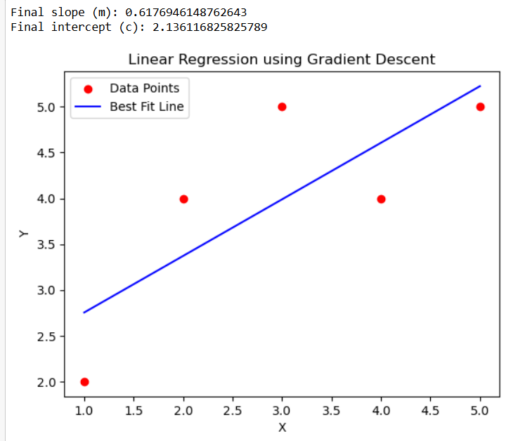

# Implementation-of-Linear-Regression-Using-Gradient-Descent

## AIM:
To write a program to predict the profit of a city using the linear regression model with gradient descent.

## Equipments Required:
1. Hardware – PCs
2. Anaconda – Python 3.7 Installation / Jupyter notebook

## Algorithm
1. Begin by collecting the input data points and setting the slope and intercept values to zero along with a fixed learning rate and number of iterations.
2. Predict the output values based on the current slope and intercept, then measure the error between the predicted and actual values.
3. Adjust the slope and intercept step by step using gradient descent so that the error gradually reduces with each iteration.
4. After completing the iterations, display the final values and draw the best fit line along with the original data points.

## Program:
```
/*
Program to implement the linear regression using gradient descent.
Developed by: G.Kavya
RegisterNumber:  25017268
*/
import numpy as np
import matplotlib.pyplot as plt

# Sample data
X = np.array([1, 2, 3, 4, 5])
Y = np.array([2, 4, 5, 4, 5])


m = 0        
c = 0        
L = 0.01     
epochs = 1000  

n = float(len(X))  


for i in range(epochs):
    Y_pred = m * X + c  
    D_m = (-2/n) * sum(X * (Y - Y_pred))  
    D_c = (-2/n) * sum(Y - Y_pred)        
    m = m - L * D_m   
    c = c - L * D_c  

print(f"Final slope (m): {m}")
print(f"Final intercept (c): {c}")


Y_pred = m * X + c

plt.scatter(X, Y, color="red", label="Data Points")
plt.plot(X, Y_pred, color="blue", label="Best Fit Line")
plt.xlabel("X")
plt.ylabel("Y")
plt.legend()
plt.title("Linear Regression using Gradient Descent")
plt.show()
```

## Output:



## Result:
Thus the program to implement the linear regression using gradient descent is written and verified using python programming.
